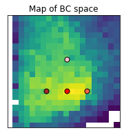

Accompanying website for "Quality Diversity for Synthesizer Sound Matching" submitted to DAFx 2020in21 (2021)

## Animation of the Evolution

The histogram of population in BC space during a typical run is shown below. Bins with lighter color have the most individuals. The x axis is the spectral flatness (dB) and the y axis is spectral centroid (Hz). As can be seen from the animation, methods with novelty objective (NS-GC, NS-LC) explore a wider region, leading to the discovery of diverse solutions.

### GA

<video width="500" height="500" controls="controls">
  <source src="video/ga_nsynth_0.mp4" type="video/mp4">
</video>

### NS-GC

<video width="500" height="500" controls="controls">
  <source src="video/nsgc_nsynth_0.mp4" type="video/mp4">
</video>

### NS-LC

<video width="500" height="500" controls="controls">
  <source src="video/nslc_nsynth_0.mp4" type="video/mp4">
</video>

## Parameter Estimation

We show the results of sound matching (parameter estimation) with Dexed (in the parameter setting 6-ops) and u-he Diva using GA/NS-GC/NS-LC. We also show results of Dexed with vibrato enabled. The results are significantly worse, perhaps owing to the mismatch with the more natural sounds in the Nsynth dataset and the added complexity of synthesis algorithm.

WARNING: VERY LOUD SOUNDS INCLUDED! (sometimes clipping)

### Dexed 6-ops

<table>
    <thead>
        <tr>
            <th colspan="4">In-domain (DX7 preset)</th>
        </tr>
    </thead>
    <tbody>
        <tr>
            <td>Original</td>
            <td>GA</td>
            <td>NS-GC</td>
            <td>NS-LC</td>
        </tr>
        <tr>
            <td><audio controls src="assets/match/medium/dexed/3_o.mp3"></audio></td>
            <td><audio controls src="assets/match/medium/dexed/3_ga.mp3"></audio></td>
            <td><audio controls src="assets/match/medium/dexed/3_nsgc.mp3"></audio></td>
            <td><audio controls src="assets/match/medium/dexed/3_nslc.mp3"></audio></td>
        </tr>
        <tr>
            <td><audio controls src="assets/match/medium/dexed/24_o.mp3"></audio></td>
            <td><audio controls src="assets/match/medium/dexed/24_ga.mp3"></audio></td>
            <td><audio controls src="assets/match/medium/dexed/24_nsgc.mp3"></audio></td>
            <td><audio controls src="assets/match/medium/dexed/24_nslc.mp3"></audio></td>
        </tr>
        <tr>
            <td><audio controls src="assets/match/medium/dexed/26_o.mp3"></audio></td>
            <td><audio controls src="assets/match/medium/dexed/26_ga.mp3"></audio></td>
            <td><audio controls src="assets/match/medium/dexed/26_nsgc.mp3"></audio></td>
            <td><audio controls src="assets/match/medium/dexed/26_nslc.mp3"></audio></td>
        </tr>
    </tbody>
</table>

<table>
    <thead>
        <tr>
            <th colspan="4">Out-of-domain (Nsynth Dataset)</th>
        </tr>
    </thead>
    <tbody>
        <tr>
            <td>Original</td>
            <td>GA</td>
            <td>NS-GC</td>
            <td>NS-LC</td>
        </tr>
        <tr>
            <td><audio controls src="assets/match/medium/nsynth/2_o.mp3"></audio></td>
            <td><audio controls src="assets/match/medium/nsynth/2_ga.mp3"></audio></td>
            <td><audio controls src="assets/match/medium/nsynth/2_nsgc.mp3"></audio></td>
            <td><audio controls src="assets/match/medium/nsynth/2_nslc.mp3"></audio></td>
        </tr>
        <tr>
            <td><audio controls src="assets/match/medium/nsynth/5_o.mp3"></audio></td>
            <td><audio controls src="assets/match/medium/nsynth/5_ga.mp3"></audio></td>
            <td><audio controls src="assets/match/medium/nsynth/5_nsgc.mp3"></audio></td>
            <td><audio controls src="assets/match/medium/nsynth/5_nslc.mp3"></audio></td>
        </tr>
        <tr>
            <td><audio controls src="assets/match/medium/nsynth/13_o.mp3"></audio></td>
            <td><audio controls src="assets/match/medium/nsynth/13_ga.mp3"></audio></td>
            <td><audio controls src="assets/match/medium/nsynth/13_nsgc.mp3"></audio></td>
            <td><audio controls src="assets/match/medium/nsynth/13_nslc.mp3"></audio></td>
        </tr>
    </tbody>
</table>

### Diva

<table>
    <thead>
        <tr>
            <th colspan="4">In-domain (Diva preset)</th>
        </tr>
    </thead>
    <tbody>
        <tr>
            <td>Original</td>
            <td>GA</td>
            <td>NS-GC</td>
            <td>NS-LC</td>
        </tr>
        <tr>
            <td><audio controls src="assets/match/diva/diva/2_orig.mp3"></audio></td>
            <td><audio controls src="assets/match/diva/diva/2_ga.mp3"></audio></td>
            <td><audio controls src="assets/match/diva/diva/2_nsgc.mp3"></audio></td>
            <td><audio controls src="assets/match/diva/diva/2_nslc.mp3"></audio></td>
        </tr>
        <tr>
            <td><audio controls src="assets/match/diva/diva/3_orig.mp3"></audio></td>
            <td><audio controls src="assets/match/diva/diva/3_ga.mp3"></audio></td>
            <td><audio controls src="assets/match/diva/diva/3_nsgc.mp3"></audio></td>
            <td><audio controls src="assets/match/diva/diva/3_nslc.mp3"></audio></td>
        </tr>
        <tr>
            <td><audio controls src="assets/match/diva/diva/4_orig.mp3"></audio></td>
            <td><audio controls src="assets/match/diva/diva/4_ga.mp3"></audio></td>
            <td><audio controls src="assets/match/diva/diva/4_nsgc.mp3"></audio></td>
            <td><audio controls src="assets/match/diva/diva/4_nslc.mp3"></audio></td>
        </tr>
        <tr>
            <td><audio controls src="assets/match/diva/diva/6_orig.mp3"></audio></td>
            <td><audio controls src="assets/match/diva/diva/6_ga.mp3"></audio></td>
            <td><audio controls src="assets/match/diva/diva/6_nsgc.mp3"></audio></td>
            <td><audio controls src="assets/match/diva/diva/6_nslc.mp3"></audio></td>
        </tr>
        <tr>
            <td><audio controls src="assets/match/diva/diva/8_orig.mp3"></audio></td>
            <td><audio controls src="assets/match/diva/diva/8_ga.mp3"></audio></td>
            <td><audio controls src="assets/match/diva/diva/8_nsgc.mp3"></audio></td>
            <td><audio controls src="assets/match/diva/diva/8_nslc.mp3"></audio></td>
        </tr>
    </tbody>
</table>

<table>
    <thead>
        <tr>
            <th colspan="4">Out-of-domain (Nsynth Dataset)</th>
        </tr>
    </thead>
    <tbody>
        <tr>
            <td>Original</td>
            <td>GA</td>
            <td>NS-GC</td>
            <td>NS-LC</td>
        </tr>
        <tr>
            <td><audio controls src="assets/match/diva/nsynth/2_orig.mp3"></audio></td>
            <td><audio controls src="assets/match/diva/nsynth/2_ga.mp3"></audio></td>
            <td><audio controls src="assets/match/diva/nsynth/2_nsgc.mp3"></audio></td>
            <td><audio controls src="assets/match/diva/nsynth/2_nslc.mp3"></audio></td>
        </tr>
        <tr>
            <td><audio controls src="assets/match/diva/nsynth/4_orig.mp3"></audio></td>
            <td><audio controls src="assets/match/diva/nsynth/4_ga.mp3"></audio></td>
            <td><audio controls src="assets/match/diva/nsynth/4_nsgc.mp3"></audio></td>
            <td><audio controls src="assets/match/diva/nsynth/4_nslc.mp3"></audio></td>
        </tr>
        <tr>
            <td><audio controls src="assets/match/diva/nsynth/13_orig.mp3"></audio></td>
            <td><audio controls src="assets/match/diva/nsynth/13_ga.mp3"></audio></td>
            <td><audio controls src="assets/match/diva/nsynth/13_nsgc.mp3"></audio></td>
            <td><audio controls src="assets/match/diva/nsynth/13_nslc.mp3"></audio></td>
        </tr>
        <tr>
            <td><audio controls src="assets/match/diva/nsynth/24_orig.mp3"></audio></td>
            <td><audio controls src="assets/match/diva/nsynth/24_ga.mp3"></audio></td>
            <td><audio controls src="assets/match/diva/nsynth/24_nsgc.mp3"></audio></td>
            <td><audio controls src="assets/match/diva/nsynth/24_nslc.mp3"></audio></td>
        </tr>
        <tr>
            <td><audio controls src="assets/match/diva/nsynth/26_orig.mp3"></audio></td>
            <td><audio controls src="assets/match/diva/nsynth/26_ga.mp3"></audio></td>
            <td><audio controls src="assets/match/diva/nsynth/26_nsgc.mp3"></audio></td>
            <td><audio controls src="assets/match/diva/nsynth/26_nslc.mp3"></audio></td>
        </tr>
    </tbody>
</table>

### Dexed 6-ops with pitch modulation

<table>
    <thead>
        <tr>
            <th colspan="4">In-domain (DX7 preset)</th>
        </tr>
    </thead>
    <tbody>
        <tr>
            <td>Original</td>
            <td>GA</td>
            <td>NS-GC</td>
            <td>NS-LC</td>
        </tr>
        <tr>
            <td><audio controls src="assets/match/large/dexed/3_o.mp3"></audio></td>
            <td><audio controls src="assets/match/large/dexed/3_ga.mp3"></audio></td>
            <td><audio controls src="assets/match/large/dexed/3_nsgc.mp3"></audio></td>
            <td><audio controls src="assets/match/large/dexed/3_nslc.mp3"></audio></td>
        </tr>
        <tr>
            <td><audio controls src="assets/match/large/dexed/24_o.mp3"></audio></td>
            <td><audio controls src="assets/match/large/dexed/24_ga.mp3"></audio></td>
            <td><audio controls src="assets/match/large/dexed/24_nsgc.mp3"></audio></td>
            <td><audio controls src="assets/match/large/dexed/24_nslc.mp3"></audio></td>
        </tr>
        <tr>
            <td><audio controls src="assets/match/large/dexed/26_o.mp3"></audio></td>
            <td><audio controls src="assets/match/large/dexed/26_ga.mp3"></audio></td>
            <td><audio controls src="assets/match/large/dexed/26_nsgc.mp3"></audio></td>
            <td><audio controls src="assets/match/large/dexed/26_nslc.mp3"></audio></td>
        </tr>
    </tbody>
</table>

<table>
    <thead>
        <tr>
            <th colspan="4">Out-of-domain (Nsynth Dataset)</th>
        </tr>
    </thead>
    <tbody>
        <tr>
            <td>Original</td>
            <td>GA</td>
            <td>NS-GC</td>
            <td>NS-LC</td>
        </tr>
        <tr>
            <td><audio controls src="assets/match/large/nsynth/2_o.mp3"></audio></td>
            <td><audio controls src="assets/match/large/nsynth/2_ga.mp3"></audio></td>
            <td><audio controls src="assets/match/large/nsynth/2_nsgc.mp3"></audio></td>
            <td><audio controls src="assets/match/large/nsynth/2_nslc.mp3"></audio></td>
        </tr>
        <tr>
            <td><audio controls src="assets/match/large/nsynth/5_o.mp3"></audio></td>
            <td><audio controls src="assets/match/large/nsynth/5_ga.mp3"></audio></td>
            <td><audio controls src="assets/match/large/nsynth/5_nsgc.mp3"></audio></td>
            <td><audio controls src="assets/match/large/nsynth/5_nslc.mp3"></audio></td>
        </tr>
        <tr>
            <td><audio controls src="assets/match/large/nsynth/13_o.mp3"></audio></td>
            <td><audio controls src="assets/match/large/nsynth/13_ga.mp3"></audio></td>
            <td><audio controls src="assets/match/large/nsynth/13_nsgc.mp3"></audio></td>
            <td><audio controls src="assets/match/large/nsynth/13_nslc.mp3"></audio></td>
        </tr>
    </tbody>
</table>

## Quality-Diversity

Original (Out-of-domain real trumpet sound):

<audio controls src="assets/app/orig.ogg">
</audio>

Best match (Red point in the BC space):

<audio controls src="assets/app/best.ogg">
</audio>

Bright (Pink):

<audio controls src="assets/app/bright.ogg">
</audio>

Pure (Brown):

<audio controls src="assets/app/pure.ogg">
</audio>

Noisy (Orange):

<audio controls src="assets/app/noise.ogg">
</audio>
