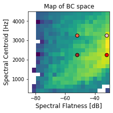

Accompanying website for "Quality Diversity for Synthesizer Sound Matching" submitted to DAFx 2020in21 (2021)

## Animation of the Evolution

The histogram of population in BC space during a typical run is shown below. Bins with lighter color has the most individuals. The x axis is the spectral flatness (dB) and the y axis is spectral centroid (Hz). As can be seen from the animation, methods with novelty objective (NS-GC, NS-LC) explores a wider region, leading to the discovery of diverse solutions.

### GA

<video width="500" height="500" controls="controls">
  <source src="video/ga_nsynth_0.mp4" type="video/mp4">
</video>

### NS-GC

<video width="500" height="500" controls="controls">
  <source src="video/nsgc_nsynth_0.mp4" type="video/mp4">
</video>

### NS-LC

<video width="500" height="500" controls="controls">
  <source src="video/nslc_nsynth_0.mp4" type="video/mp4">
</video>

## Parameter Estimation

### In-domain

Original:

GA:

NS-GC:

NS-LC:

### Out-of-domain

Original:

GA:

NS-GC:

NS-LC:

## Quality-Diversity

Original (Out-of-domain electronic keyboard sound):

<audio controls src="assets/app/orig.wav">
</audio>

Best match (Red point in the BC space):

<audio controls src="assets/app/best.wav">
</audio>

Pure (Brown):

<audio controls src="assets/app/pure.wav">
</audio>

Bright (Pink):

<audio controls src="assets/app/bright.wav">
</audio>

Pure and Bright (Orange):

<audio controls src="assets/app/pb.wav">
</audio>
